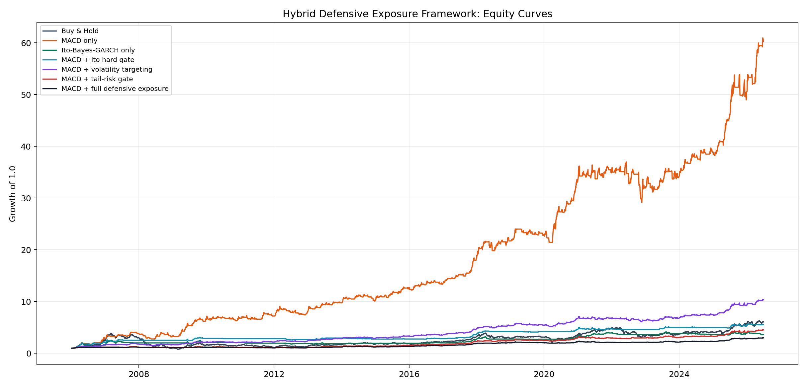
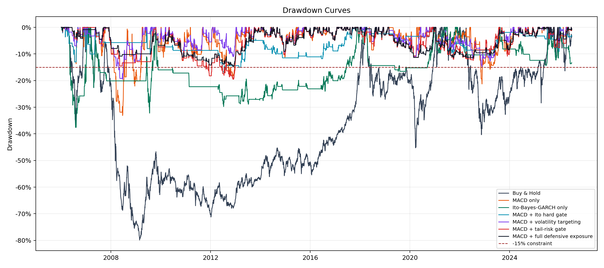
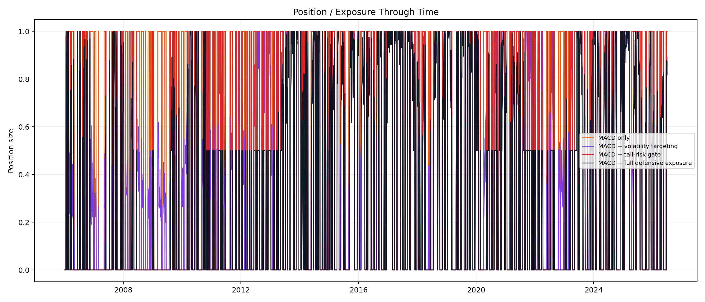
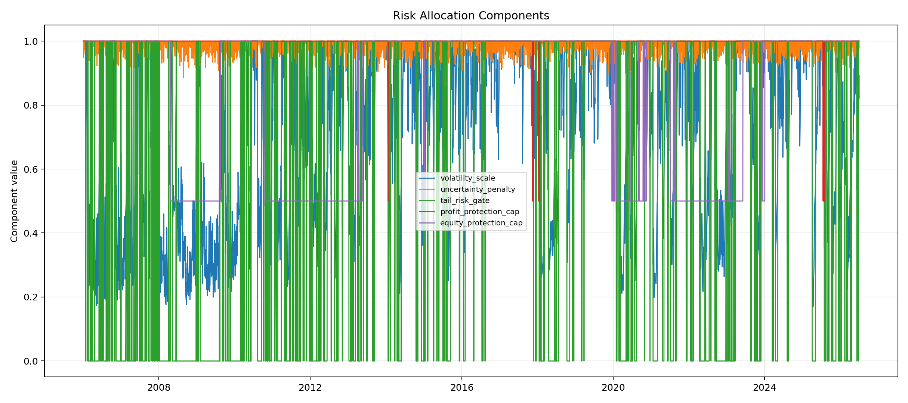
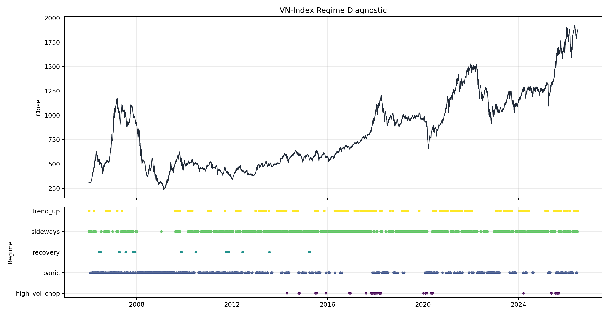
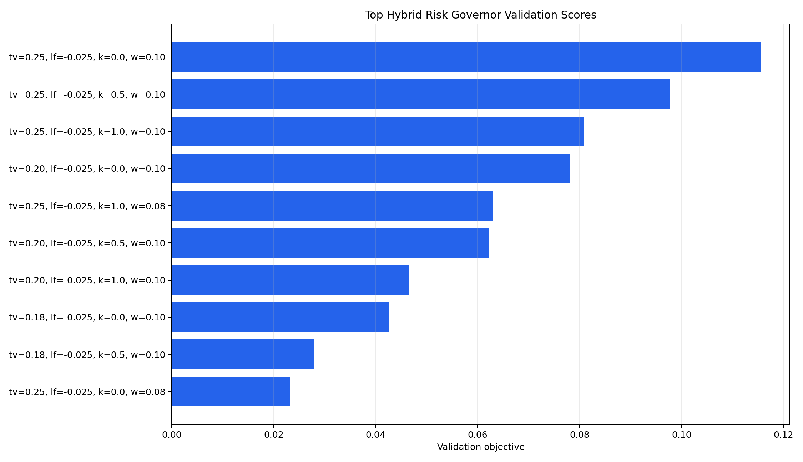
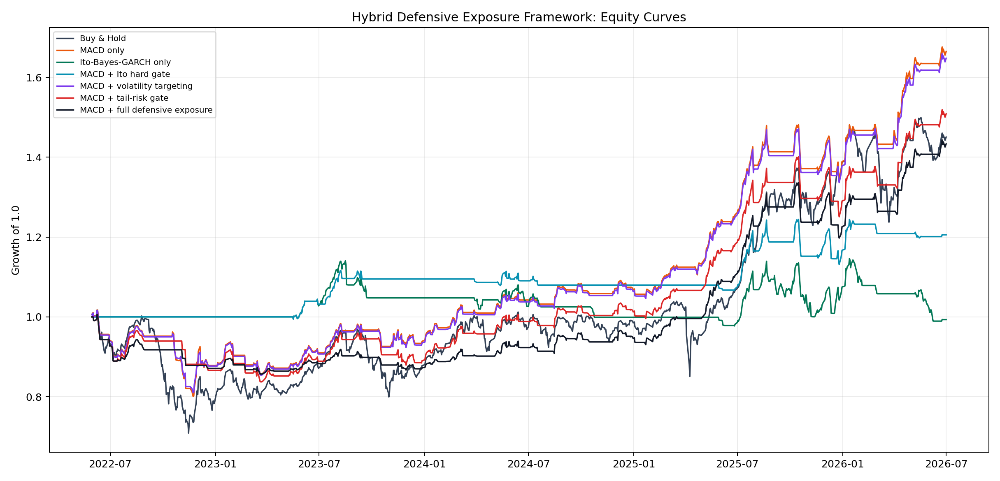
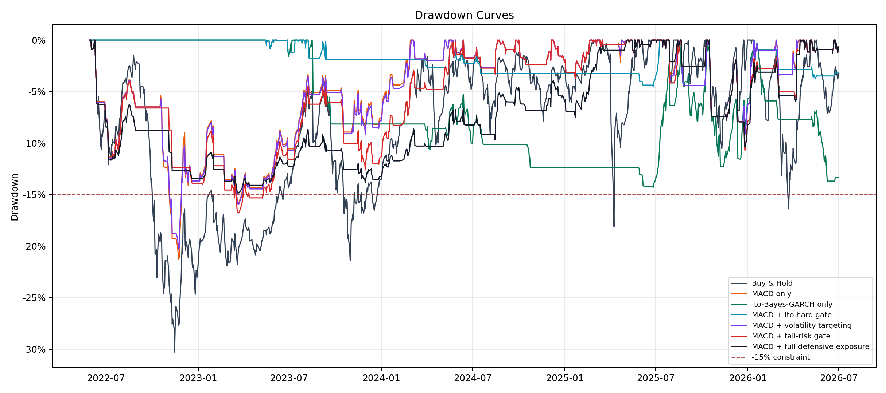
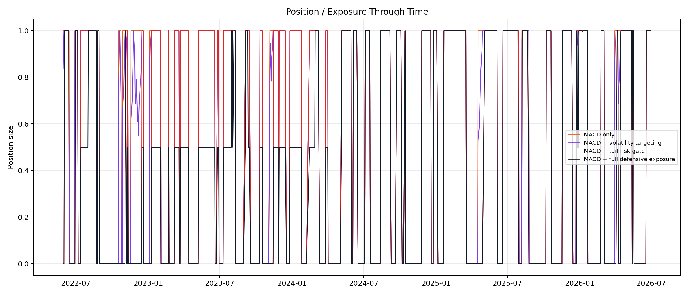

# VN-Index Stochastic Calculus, Bayes-GARCH và MACD Backtest

Repo này kiểm định chiến lược ra/vào lệnh VN-Index dựa trên Stochastic Calculus, bổ đề Ito, chuyển động Brown, Bayes-GARCH và so sánh với thuật toán MACD tối ưu `MACD(6,26,12)` trong điều kiện chỉ `long` hoặc `exit/cash`.

## Nội dung chính

- `stochastic_ito_bayes_garch_strategy.py`: pipeline chính với tham số đã tối ưu.
- `optimize_strategy_parameters.py`: tối ưu tham số trên validation, sau đó đánh giá out-of-sample trên test.
- `stress_year_backtest.py`: stress-test 3 chiến lược trong các năm VN-Index biến động khó khăn nhất.
- `run_hybrid_experiment.py`: framework hybrid mới, trong đó MACD là alpha engine và Ito-Bayes-GARCH là defensive exposure/risk governor.
- `optimize_hybrid_risk_governor.py`: tối ưu tham số risk governor trên validation và đánh giá test độc lập.
- `src/`: module hóa data, indicator, forecast, risk governor, strategy, backtester, metrics và plots cho hybrid framework.
- `VN_Index_Stochastic_MACD_Backtest.ipynb`: notebook trực quan hóa, nhận xét chi tiết và so sánh mô hình.
- `READ.md`: báo cáo Markdown chi tiết với total điểm, annual return, rủi ro nâng cao và thống kê lệnh.
- `outputs_stochastic_calculus/`: CSV, PNG, report và bảng backtest sau khi cập nhật tham số tối ưu.
- `outputs_optimization/`: kết quả grid search, bảng tham số tối ưu và backtest test cuối.
- `outputs_stress_years/`: bảng, hình ảnh và báo cáo stress-test theo từng năm biến động mạnh.
- `outputs_hybrid_defensive_exposure/`: output framework hybrid defensive exposure.
- `outputs_hybrid_optimization/`: output tối ưu tham số hybrid risk governor.

## Tham số đang chốt trong pipeline chính

| Model | Parameters |
|---|---|
| Ito Bayes-GARCH | `drift_window=126`, `prior_strength=63`, `risk_buffer=0.08` |
| MACD | `fast=6`, `slow=26`, `signal=12` |

## Chạy lại

```bash
/home/namngyh/miniconda3/envs/eda/bin/python stochastic_ito_bayes_garch_strategy.py
```

Chạy tối ưu tham số:

```bash
/home/namngyh/miniconda3/envs/eda/bin/python optimize_strategy_parameters.py
```

Chạy stress-test các năm biến động mạnh:

```bash
/home/namngyh/miniconda3/envs/eda/bin/python stress_year_backtest.py
```

Chạy hybrid defensive exposure framework:

```bash
/home/namngyh/miniconda3/envs/eda/bin/python run_hybrid_experiment.py
```

Chạy tối ưu hybrid risk governor:

```bash
/home/namngyh/miniconda3/envs/eda/bin/python optimize_hybrid_risk_governor.py
```

## Kết quả test nổi bật sau cập nhật

Khung thời gian test: `2020-05-14` đến `2026-07-01` (`1,532` phiên giao dịch).

| Strategy | Total points | Total return | CAGR | Sharpe | Max drawdown |
|---|---:|---:|---:|---:|---:|
| Ito Bayes-GARCH | 274.26 | 30.08% | 4.42% | 0.489 | -13.99% |
| MACD(6,26,12) | 1,101.27 | 130.15% | 14.70% | 1.223 | -21.27% |
| Buy & Hold | 1,031.16 | 123.61% | 14.15% | 0.768 | -40.34% |

## Stress-Test Các Năm Biến Động Mạnh

Stress-test chọn năm dựa trên composite stress score của VN-Index: annual volatility cao, downside volatility cao, max drawdown sâu và annual return yếu. 5 năm được chọn tự động là `2008`, `2022`, `2020`, `2018`, `2006`.

| Year | VN-Index return | Annual volatility | Max drawdown | Worst day | Stress score |
|---|---:|---:|---:|---:|---:|
| 2008 | -65.96% | 37.05% | -68.85% | -4.69% | 7 |
| 2022 | -32.78% | 24.83% | -40.34% | -4.95% | 16 |
| 2020 | 14.87% | 22.79% | -33.51% | -6.28% | 24 |
| 2018 | -9.32% | 22.28% | -26.21% | -5.10% | 26 |
| 2006 | 144.48% | 32.27% | -36.81% | -4.84% | 29 |

| Year | Best total return | Best drawdown control | Main observation |
|---|---|---|---|
| 2008 | Ito Bayes-GARCH `0.00%` | Ito Bayes-GARCH `0.00%` | Ito đứng ngoài hoàn toàn nên tránh được thị trường giảm sâu; MACD vẫn lỗ `-11.96%`; Buy & Hold giảm `-65.96%`. |
| 2022 | Ito Bayes-GARCH `-7.92%` | Ito Bayes-GARCH `-7.92%` | Cả ba đều chịu áp lực; Ito giảm ít nhất nhờ exposure chỉ `7.63%`. |
| 2020 | MACD(6,26,12) `46.13%` | Ito Bayes-GARCH `-4.23%` | Năm có cú sốc và hồi phục nhanh; MACD bắt trend hồi phục tốt nhất. |
| 2018 | MACD(6,26,12) `18.71%` | MACD(6,26,12) `-8.52%` | MACD vượt cả return và drawdown; Buy & Hold âm `-9.32%`. |
| 2006 | Buy & Hold `144.48%` | MACD(6,26,12) `-13.69%` | Năm tăng rất mạnh nhưng rung lắc lớn; Buy & Hold ăn trọn upside, MACD kiểm soát drawdown tốt hơn. |


Kết luận stress-test: Ito Bayes-GARCH là mô hình phòng thủ rõ rệt, đặc biệt trong năm giảm sâu như `2008` và `2022`; MACD(6,26,12) mạnh hơn khi thị trường có xu hướng hồi phục hoặc momentum rõ như `2020` và `2018`; Buy & Hold thắng trong năm tăng cực mạnh như `2006` nhưng phải chịu drawdown lớn.

## Hybrid Defensive Exposure Framework

Phiên bản hybrid mới giữ MACD làm alpha engine và chuyển Ito-Bayes-GARCH thành risk governor/capital allocation engine. Công thức lõi:

`position_t = MACD_signal_t × risk_allocation_t`

Trong đó risk allocation kết hợp volatility targeting, tail-risk hard exit, Bayesian uncertainty penalty và profit/equity protection. Regime detection hiện là report-only diagnostic để giải thích mô hình, chưa trực tiếp điều khiển position.

| Strategy | Total return | CAGR | Sortino | Calmar | Max drawdown | Exposure |
|---|---:|---:|---:|---:|---:|---:|
| MACD only | 5956.38% | 22.46% | 1.562 | 0.678 | -33.13% | 54.11% |
| MACD + volatility targeting | 936.60% | 12.24% | 1.387 | 0.625 | -19.57% | 40.29% |
| MACD + full defensive exposure | 197.97% | 5.54% | 0.690 | 0.376 | -14.72% | 29.78% |
| Buy & Hold | 506.32% | 9.31% | 0.670 | 0.116 | -79.88% | 100.00% |

Kết luận nhanh: full defensive exposure model đạt constraint max drawdown `-15%` với max drawdown thực tế `-14.72%`, nhưng không đáng dùng hơn MACD only nếu mục tiêu chính là return hoặc risk-adjusted return. Giá trị chính của Ito-Bayes-GARCH trong bản này là giảm tail risk và drawdown, đặc biệt ở `2008`, `2022`, nhưng risk governor hiện còn quá bảo thủ và làm mất nhiều upside trong trend_up/recovery.











## Tối Ưu Hybrid Risk Governor

Tối ưu mới giữ MACD(6,26,12) cố định làm alpha engine và chỉ grid-search phần risk governor trên validation. Best params:

| Parameter | Value |
|---|---:|
| target_volatility | 25.00% |
| loss_floor | -2.50% |
| uncertainty_penalty_k | 0.00 |
| profit_lock_threshold | 12.00% |
| warning_drawdown | 10.00% |
| danger_drawdown | 15.00% |

Kết quả final test sau tối ưu:

| Strategy | Total return | CAGR | Sortino | Calmar | Max drawdown | Exposure |
|---|---:|---:|---:|---:|---:|---:|
| MACD only | 66.48% | 13.41% | 1.000 | 0.630 | -21.27% | 54.95% |
| MACD + volatility targeting | 64.79% | 13.12% | 1.014 | 0.647 | -20.28% | 53.77% |
| MACD + full defensive exposure optimized | 43.34% | 9.29% | 0.857 | 0.626 | -14.84% | 39.57% |
| Buy & Hold | 45.04% | 9.61% | 0.678 | 0.317 | -30.28% | 100.00% |

Kết luận: bản optimized full defensive đạt constraint max drawdown `-15%` với max drawdown `-14.84%`, giảm rủi ro rõ so với MACD only `-21.27%`. Nhưng Calmar/Sortino vẫn chưa vượt MACD only và volatility targeting, nên đây là cấu hình phù hợp khi drawdown constraint là bắt buộc.









## Biểu đồ chính

- `outputs_stochastic_calculus/forecast_train_test.png`
- `outputs_stochastic_calculus/backtest_equity_curve.png`
- `outputs_stochastic_calculus/macd_indicator_test.png`
- `outputs_stochastic_calculus/macd_signals_on_price.png`
- `outputs_stochastic_calculus/drawdown_comparison_test.png`
- `outputs_stochastic_calculus/rolling_volatility_comparison_test.png`
- `outputs_stochastic_calculus/return_distribution_test.png`
- `outputs_optimization/optimized_equity_curve_test.png`
- `outputs_optimization/ito_top_validation_scores.png`
- `outputs_optimization/macd_top_validation_scores.png`
- `outputs_stress_years/stress_year_ranking.png`
- `outputs_stress_years/stress_year_equity_curves.png`
- `outputs_stress_years/stress_year_drawdowns.png`
- `outputs_stress_years/stress_year_metric_heatmap.png`
- `outputs_hybrid_defensive_exposure/equity_curves.png`
- `outputs_hybrid_defensive_exposure/drawdown_curves.png`
- `outputs_hybrid_defensive_exposure/position_exposure.png`
- `outputs_hybrid_defensive_exposure/risk_allocation_components.png`
- `outputs_hybrid_defensive_exposure/regime_chart.png`
- `outputs_hybrid_optimization/optimized_test_position_exposure.png`
- `outputs_hybrid_optimization/optimized_test_drawdown_curves.png`
- `outputs_hybrid_optimization/optimized_test_equity_curves.png`
- `outputs_hybrid_optimization/hybrid_validation_top_scores.png`

Đây là research backtest, không phải khuyến nghị đầu tư hay hệ thống giao dịch thực chiến.
